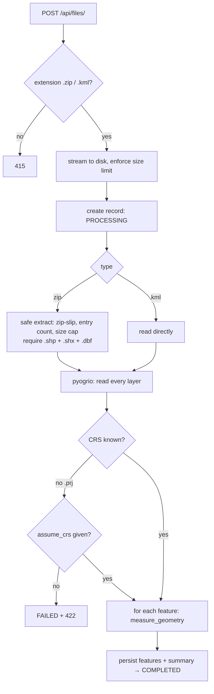

# GeoMeasure

A FastAPI service that accepts a **Shapefile (`.zip`)** or **KML**, extracts every feature, and returns
**area (polygons)** and **length (lines)** measurements computed in an appropriate **projected CRS**
— never in degrees.

- Python 3.12 · FastAPI · SQLAlchemy 2 · PostgreSQL (SQLite fallback) · geopandas/pyogrio · shapely · pyproj
- 60+ tests, including checks against an independent geodesic (ellipsoidal) calculation
- One-command run with Docker Compose; interactive docs at `/docs`

---

## 1. Setup

### Option A — Docker (recommended)

```bash
docker compose up --build
```

API: http://localhost:8000 · Swagger UI: http://localhost:8000/docs

### Option B — local Python

```bash
python -m venv .venv && source .venv/bin/activate
pip install -r requirements-dev.txt
uvicorn app.main:app --reload
```

With no `DATABASE_URL` set it uses a local SQLite file (`./data/app.db`), so nothing else is needed.
To use Postgres, copy `.env.example` to `.env` and export the variables.

### Run the tests

```bash
pytest -q
```

### Try it with the bundled samples

```bash
curl -F "file=@samples/survey.kml"          http://localhost:8000/api/files/
curl -F "file=@samples/parcels_wgs84.zip"   http://localhost:8000/api/files/
curl -F "file=@samples/roads_utm43n.zip"    http://localhost:8000/api/files/
```

### Configuration

| Variable | Default | Meaning |
|---|---|---|
| `DATABASE_URL` | `sqlite:///./data/app.db` | SQLAlchemy URL (compose uses Postgres) |
| `UPLOAD_DIR` | `./data/uploads` | Where original uploads are kept |
| `MAX_UPLOAD_MB` | `50` | Max upload size → `413` |
| `MAX_UNCOMPRESSED_MB` | `300` | Max extracted size of a zip (zip-bomb guard) |
| `MAX_ZIP_ENTRIES` | `200` | Max files inside a zip |

---

## 2. API

| Method | Path | Purpose |
|---|---|---|
| `POST` | `/api/files/` | Upload + process a `.zip` (Shapefile) or `.kml` |
| `GET` | `/api/files/{id}/` | File information / status |
| `GET` | `/api/files/{id}/measurements/` | Per-feature measurements + summary (paginated, filterable) |
| `GET` | `/api/files/{id}/features/` | *(extra)* Extracted features: index, geometry type, GeoJSON geometry, CRS, properties |
| `GET` | `/health` | Liveness |

### `POST /api/files/`

Multipart form field `file`. Optional query param `assume_crs` (e.g. `EPSG:4326`) is used **only** when a
shapefile has no `.prj`.

```bash
curl -F "file=@samples/parcels_wgs84.zip" http://localhost:8000/api/files/
```
```json
{
  "id": "c9c4d642b70849128839abe8e07ce3a7",
  "filename": "parcels_wgs84.zip",
  "file_type": "shapefile",
  "feature_count": 2,
  "crs": "EPSG:4326",
  "status": "COMPLETED",
  "error": null,
  "created_at": "2026-10-07T04:01:23.637124Z",
  "completed_at": "2026-10-07T04:01:23.649180Z"
}
```

| Status | When |
|---|---|
| `201` | Processed (`status: COMPLETED`) |
| `400` | Empty file |
| `413` | Over `MAX_UPLOAD_MB` |
| `415` | Not `.zip` / `.kml` |
| `422` | Unreadable content: corrupt zip, missing `.shx`/`.dbf`, no CRS, zip-slip, bad `assume_crs`, … |

For content errors the record is kept as `FAILED` and returned so the client has an id to inspect:

```json
{ "detail": "'noprj.shp' has no CRS (.prj missing or unreadable). Add the .prj file, or re-upload with ?assume_crs=EPSG:<code>.",
  "file": { "id": "…", "status": "FAILED", "feature_count": 0, "crs": null, "error": "…" } }
```

### `GET /api/files/{id}/`

Same object as the upload response. `404` for an unknown id.

### `GET /api/files/{id}/measurements/`

Query params: `limit` (1–1000, default 100), `offset`, `geometry_type` (e.g. `Polygon`),
`measurement_status` (`MEASURED` | `NOT_APPLICABLE` | `UNSUPPORTED` | `FAILED`).
Returns `409` if the file is not `COMPLETED`.

```bash
curl "http://localhost:8000/api/files/<id>/measurements/?geometry_type=Polygon&limit=50"
```
```json
{
  "file_id": "c9c4d642…",
  "total": 2, "limit": 100, "offset": 0,
  "summary": {
    "feature_count": 2,
    "by_geometry_type": { "Polygon": 2 },
    "by_status": { "MEASURED": 2 },
    "total_area_m2": 72500.0, "total_area_ha": 7.25,
    "total_length_m": 0.0, "total_length_km": 0.0
  },
  "items": [
    {
      "index": 0,
      "layer": "parcels_wgs84",
      "geometry_type": "Polygon",
      "measurement_status": "MEASURED",
      "measurements": { "area_m2": 62500.0, "area_ha": 6.25, "perimeter_m": 1000.0 },
      "source_crs": "EPSG:4326",
      "measurement_crs": "EPSG:32644",
      "properties": { "name": "Kadapa plot", "owner": "A" },
      "warnings": [],
      "reason": null
    }
  ]
}
```

Measurement status values:

| Status | Meaning | `measurements` |
|---|---|---|
| `MEASURED` | Polygon / MultiPolygon → `area_m2`, `area_ha`, `perimeter_m`; LineString / MultiLineString → `length_m`, `length_km` | filled |
| `NOT_APPLICABLE` | Point / MultiPoint — nothing to measure | `{}` |
| `UNSUPPORTED` | GeometryCollection, empty or null geometry | `{}` + `reason` |
| `FAILED` | Supported type but this feature couldn't be measured (e.g. lon/lat out of range) | `{}` + `reason` |

A bad feature never fails the file: it is reported per feature and everything else is still measured.

### `GET /api/files/{id}/features/`

Same pagination. Each item: `index`, `layer`, `geometry_type`, `geometry` (GeoJSON in the **source** CRS), `crs`, `properties`.

---

## 3. Architecture

```
app/
  main.py              FastAPI app, lifespan (create tables), error handler
  api/files.py         HTTP layer only: validation, status codes, pagination
  services/
    ingest.py          upload saving, safe zip extraction, reading features (pyogrio)
    crs.py             choosing the measurement CRS, reprojection
    measure.py         area/length logic, geometry repair, summary
    processor.py       orchestration: extract → read → measure → persist
  models.py            UploadedFile, Feature (SQLAlchemy)
  schemas.py           Pydantic response models
  exceptions.py        domain errors → HTTP status
tests/                 unit tests per service + end-to-end API tests
```

### File-processing flow



* All layers are read (KML folders become separate layers; a zip may hold several shapefiles).
* Properties are made JSON-safe (numpy scalars, `NaN` → `null`, dates → ISO strings); KML-driver bookkeeping columns are dropped.
* Geometry is stored as GeoJSON in the source CRS next to the source CRS label.
* The original upload is kept on disk; extracted scratch files are deleted after processing.

### Measurement-calculation flow

`measure_geometry(geom, source_crs)` for each feature:

1. Null / empty → `UNSUPPORTED`. Point → `NOT_APPLICABLE`. Anything that isn't (Multi)Polygon / (Multi)LineString → `UNSUPPORTED`.
2. Drop Z values (`force_2d`) — altitude must not affect planar area/length.
3. Geographic source: sanity-check lon/lat ranges.
4. Invalid polygon → `make_valid`, keep only polygonal parts, add a `warnings` entry.
5. Choose the measurement CRS (below) and reproject.
6. Compute `area` / `length` / `perimeter` in the projected CRS, convert to metres, round to 4 d.p.
7. Any exception inside a feature becomes a per-feature `FAILED` with a reason.

### CRS handling

| Source CRS | Measurement CRS | Why |
|---|---|---|
| Geographic (EPSG:4326, NAD83, …; **all KML**) | **UTM zone of the feature's centroid** (EPSG:326xx north / 327xx south; UPS 32661/32761 beyond 84°N / 80°S) | Degrees are not distances. UTM is conformal-ish and accurate to roughly 0.1–0.2 % inside a zone |
| Web Mercator (EPSG:3857) | Same UTM selection | Mercator inflates area by 1/cos²(lat) (~+5 % at Bengaluru, +300 % at 60°N), so it is deliberately *not* trusted |
| Any other projected CRS | The CRS itself | The author already chose a suitable CRS; the linear unit factor is applied so **feet → metres** is correct |
| No `.prj` | `422`, or `assume_crs=` | Guessing a CRS silently gives wrong numbers |

The UTM zone is chosen **per feature**, so one file spanning several zones (the sample has Kadapa → zone 44N and
Sydney → zone 56S) is still measured accurately. The response reports both `source_crs` and `measurement_crs`.

---

## 4. Design decisions & alternatives considered

| Decision | Alternatives | Why this one |
|---|---|---|
| **Per-feature UTM** | One CRS per file; equal-area projection (e.g. Lambert azimuthal centred on each feature); pure geodesic (`pyproj.Geod`) | UTM is the conventional, explainable choice and was required by the brief (projected CRS). Per-file CRS breaks for multi-zone files. An equal-area CRS is slightly better for area at zone edges, but less familiar. Geodesic is the most accurate and is used as the **independent oracle in tests** (UTM must agree within 0.3 %) |
| **FastAPI** | Django + DRF | Typed request/response models, automatic OpenAPI docs, small surface area |
| **Postgres + JSONB, no PostGIS** | PostGIS | The service only stores and returns results; no spatial queries. PostGIS adds ops weight for no current benefit (listed in future scope) |
| **Synchronous processing** in a plain `def` endpoint (runs in FastAPI's threadpool) | Background task / Celery queue | Simple and deterministic for files that fit the size cap. The `status` field and the `processor` service boundary mean moving to a queue later doesn't change the API |
| **pyogrio + geopandas** to read | fiona; hand-written KML parser (lxml) | One reader for both formats via GDAL, wheels bundle GDAL (no system packages), pyogrio is faster than fiona |
| **Features persisted** (not recomputed per request) | Recompute on each GET | Cheap pagination/filtering, summary precomputed once, stable results |
| **Per-feature status** instead of failing the file | Reject the whole file | Real survey files contain odd geometries; one bad feature shouldn't hide 119 good ones |
| **Failed uploads keep a `FAILED` record** with `422` + body | Plain `422`, no record | The client gets an id and the reason, and can `GET` it later |
| **`make_valid` for broken polygons** (with a warning) | Skip them; `buffer(0)` | Self-intersections are common in hand-digitised data; `make_valid` preserves the area faithfully, `buffer(0)` can silently drop parts |
| **Security**: zip-slip check, entry cap, extraction size measured on bytes actually written, upload size cap, sanitised stored filename | Trust the archive | Uploaded archives are untrusted input |
| **Rounded output** (4 d.p.) | Raw floats | Avoids noise like `62499.99999999`; precision is far below real-world accuracy anyway |

Known limitations: UTM special zones (Norway/Svalbard) are not special-cased; geometries crossing the antimeridian
are not split; very large files are read into memory (guarded by the size cap).

---

## 5. Learning

Working on this assignment taught me some great lessons about handling geospatial data in production:

*   **Projections matter:** I initially didn't realize how much Web Mercator distorts area measurements. Seeing a 1 km² area artificially inflated by ~5% at Bengaluru's latitude made me switch to using UTM for accurate measurements.
*   **Testing mathematically:** Instead of just testing my code against itself, I learned to validate my projected area calculations against an independent geodesic approach (`pyproj.Geod`). It gave me much higher confidence in the results.
*   **Real-world edge cases:** KML files proved to be quite tricky. GDAL adds extra bookkeeping columns and splits data across layers by folder. I had to ensure I was iterating through all layers and sanitizing the output.
*   **Security first:** Handling zip files made me aware of risks like zip-slips and decompression bombs. I added checks to ensure the backend stays safe regardless of what's uploaded.

Overall, it was a great deep dive into FastAPI and geospatial data engineering!

---
*Built by Sriram Kolli*

## 6. Future scope

* Async processing (Celery/RQ + Redis) with progress and webhooks for very large files; upload streaming/chunking
* PostGIS for spatial queries (bbox, intersects, nearest) and spatial indexes
* More formats: GeoJSON, GeoPackage, KMZ, DXF; multi-file shapefile bundles
* Per-feature option for equal-area or geodesic measurement; configurable output units
* Handle antimeridian crossings and UTM exceptions; reproject-to-custom-CRS endpoint
* Auth (API keys / OAuth), per-user ownership, rate limiting, retention policy for uploads
* Alembic migrations, structured logging/metrics, OpenTelemetry tracing
* A small React + Leaflet/MapLibre viewer showing features and their measurements on a map
